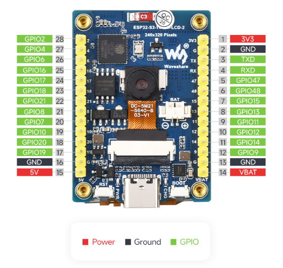
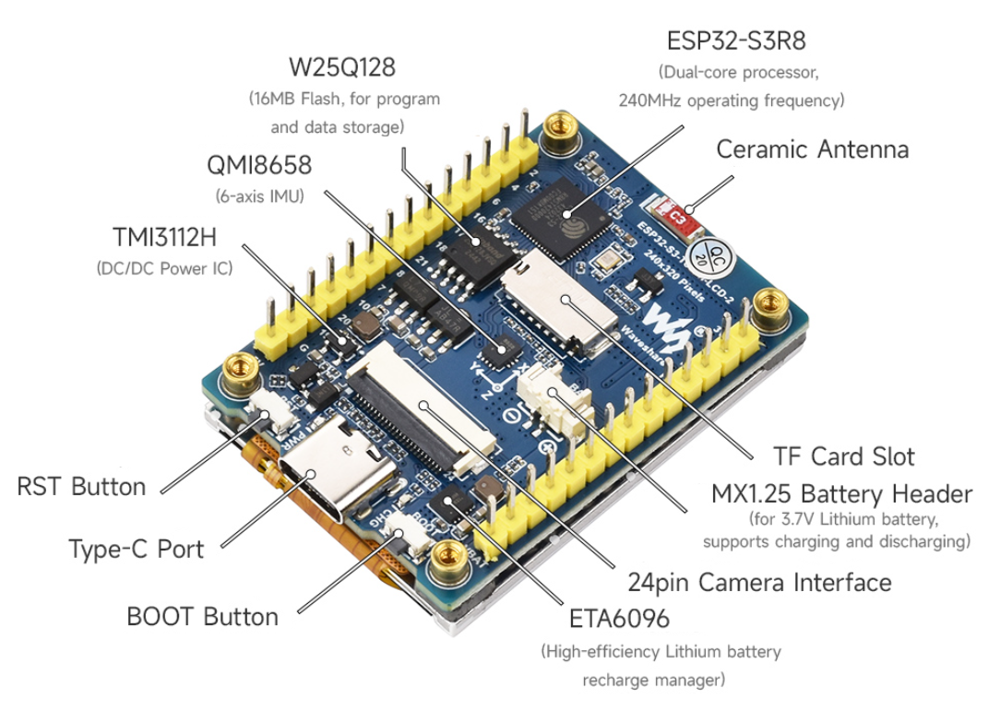

# NH02 Hardware Bench

`nh02` (`192.168.88.61`) is the hardware bench host for the ESP32-S3 stand with GPS, display, compass, and stepper connected over USB.

## Board Reference

The current bench board is the Waveshare ESP32-S3-LCD-2 class board. Local
copies of the vendor pinout/resource images are kept under
`docs/assets/hardware/` so hardware checks do not depend on finding the product
page again.

## MicroSD runtime logging

- The onboard microSD slot is used for water-debug capture when a FAT-formatted
  card is inserted.
- Firmware writes JSONL files under `/boatlock/blNNNNN.jsonl`.
- Each file rotates at approximately `8 MiB`.
- If free space drops below approximately `8 MiB`, older BoatLock log files are
  deleted until approximately `16 MiB` is free or only the active file remains.
- Records include `type=session`, `type=log`, and 5 Hz `type=nav` snapshots with
  GNSS, heading, speed, anchor state, mode/status, motor, stepper, BLE, and
  `sd_dropped` counters.
- SD failure must not block control. The logger uses a bounded RAM queue and
  drops old lines when the card is absent, slow, or full.

## Remote runtime

- Remote USB device:
  - `/dev/serial/by-id/usb-Espressif_USB_JTAG_serial_debug_unit_98:88:E0:03:BA:5C-if00`
- Remote tool runtime:
  - `/opt/boatlock-hw/.venv`
- Remote runtime root:
  - `/opt/boatlock-hw`
- Remote RFC2217 service:
  - `boatlock-esp32s3-rfc2217.service`
- RFC2217 URL:
  - `rfc2217://192.168.88.61:4000?ign_set_control`

## Change boundary on nh02

- BoatLock-owned host changes are limited to:
  - `/opt/boatlock-hw/`
  - `/etc/systemd/system/boatlock-esp32s3-rfc2217.service`
- Android USB validation on `nh02` may additionally install the Ubuntu `adb` package through the tracked remote helper when that workflow is explicitly used.
- `install.sh` must be rerun after changing the tracked service or remote flash helper.
- `install.sh` must also be rerun after changing tracked remote Android helpers.
- `install.sh` restarts only `boatlock-esp32s3-rfc2217.service`; it does not touch unrelated services on `nh02`.

## Local workflow

- Install or refresh the remote bench runtime:
  - `tools/hw/nh02/install.sh`
- Standard moved-hardware deploy through the phone BLE OTA bridge:
  - `tools/hw/nh02/deploy.sh`
  - this builds `esp32s3`, builds the ordinary release APK, refreshes Android helpers only, installs that exact APK, serves `firmware.bin`, uploads over BLE OTA, and waits for telemetry recovery
- Reuse already-built firmware/APK through the same standard deploy path:
  - `tools/hw/nh02/deploy.sh --no-build`
- Seed or recover over USB through `nh02`:
  - `tools/hw/nh02/flash.sh`
- Flash the dev/HIL acceptance profile through `nh02`:
  - `tools/hw/nh02/flash.sh --profile acceptance`
- Build a firmware binary for BLE OTA:
  - `cd boatlock && pio run -e esp32s3 && shasum -a 256 .pio/build/esp32s3/firmware.bin`
- Upload firmware without ESP32 USB:
  - publish or serve `firmware.bin` from a trusted URL, then use the app Settings screen with Firmware OTA URL + SHA-256
- Low-level phone-bridged BLE OTA app-check, used by `deploy.sh`:
  - `tools/hw/nh02/android-run-app-check.sh --ota --ota-firmware boatlock/.pio/build/esp32s3/firmware.bin --wait-secs 1800`
- Flash the current build without rebuilding:
  - `tools/hw/nh02/flash.sh --no-build`
- Run post-flash hardware acceptance:
  - `tools/hw/nh02/acceptance.sh`
- Run acceptance without forcing a reset first:
  - `tools/hw/nh02/acceptance.sh --no-reset`
- Open the serial monitor through RFC2217:
  - `tools/hw/nh02/monitor.sh`
- Check bridge/device status on the bench host:
  - `tools/hw/nh02/status.sh`
- Install or refresh Android USB tooling on `nh02`:
  - `tools/hw/nh02/android-install.sh`
- Check Android USB and `adb` visibility on `nh02`:
  - `tools/hw/nh02/android-status.sh`
- Install the normal production app APK on the `nh02` phone:
  - `tools/hw/nh02/android-install-app.sh`
- Enable Android ADB over Wi-Fi after initial USB discovery:
  - `tools/hw/nh02/android-wifi-debug.sh`
- Android smoke/check wrappers use ADB Wi-Fi by default when no `--serial` is
  passed. Set `BOATLOCK_NH02_ANDROID_WIFI_ADB=0` to force the default `adb`
  target selection.
- Build, install/update, and run the Android BLE smoke app through `nh02`:
  - `tools/hw/nh02/android-run-smoke.sh`
- Build, install/update, and run the Android BLE reconnect smoke app through `nh02`:
  - `tools/hw/nh02/android-run-smoke.sh --reconnect --wait-secs 130`
- Build, install/update, and prove phone recovery after ESP32 reboot:
  - `tools/hw/nh02/android-run-smoke.sh --esp-reset --wait-secs 130`
- Build, install/update, and prove compass calibration command delivery:
  - `tools/hw/nh02/android-run-app-check.sh --compass --wait-secs 130`
- Build, install/update, and prove BLE-visible hardware GPS fix:
  - `tools/hw/nh02/android-run-app-check.sh --gps --wait-secs 180`
- Run the full standard on-device HIL suite on the bench using the normal
  release firmware profile:
  - `tools/hw/nh02/run-sim-suite.sh`
- Run the smoke app without reinstalling the APK:
  - `tools/hw/nh02/android-run-smoke.sh --no-install`

## Profile-Aware Gate

Firmware command-scope enforcement is implemented in the shared BLE command
path. The normal `esp32s3` firmware accepts release commands, including setup,
BLE OTA, and `SIM_*`. The `esp32s3_acceptance` firmware additionally accepts
dev/HIL sensor injection such as `SET_PHONE_GPS`.

The effective firmware profile must stay visible at every bench entry point:

- USB flash wrappers must print the effective PlatformIO environment and
  command-scope profile.
- `tools/hw/nh02/flash.sh` accepts the normal `esp32s3` environment by default
  and `--profile acceptance` only when dev/HIL injection is required.
- `tools/hw/nh02/acceptance.sh` must know which profile is flashed. Normal
  acceptance keeps `SIM_*`, setup, and BLE OTA available while external
  sensor-injection commands stay gated.
- `tools/hw/nh02/android-run-app-check.sh --ota` runs against the normal firmware
  and must prove post-update telemetry recovery.
- `tools/hw/nh02/android-run-app-check.sh --sim`, `--sim-suite`, and the smoke
  `sim` mode run against the normal firmware.
- `tools/hw/nh02/run-sim-suite.sh` is the standard full on-device HIL bench
  gate. It flashes the normal firmware, runs boot acceptance, then runs
  production-app `sim_suite`.
- `tools/hw/nh02/install.sh` must be rerun after changing any tracked remote
  helper that enforces or reports the selected profile.

Accepted flash profile selector:

- `--profile acceptance` or `BOATLOCK_PIO_ENV=acceptance` builds
  `esp32s3_acceptance`.

Accepted direct PlatformIO environments:

- `esp32s3`: normal firmware with setup, BLE OTA, and release commands.
- `esp32s3_acceptance`: bench profile with dev/HIL sensor injection enabled.
- `esp32s3_bno08x_sh2_uart`: normal command profile with SH2-UART compass
  support.
- `gpio_probe` and `uart_rvc_probe_rx12`: debug probe builds, not release
  artifacts.

`BOATLOCK_PIO_ENV` must name one of the accepted selectors above. An empty or
unknown value is a wrapper error and must not silently fall back to another
build.

Expected operator flow:

1. Use phone BLE OTA as the normal moved-hardware update path; use USB flash
   only to seed/recover the device.
2. Run USB-bench water-readiness checks against the normal firmware and verify
   external-injection commands are rejected without actuation.
3. Run phone BLE OTA proof with `tools/hw/nh02/deploy.sh`.
4. Run quick on-device HIL on the normal firmware with the standard `nh02`
   acceptance plus Android `sim` smoke/check path.
5. For the standard full on-device HIL suite, run
   `tools/hw/nh02/run-sim-suite.sh`; it flashes and validates the normal
   firmware before the suite.
6. Use `--profile acceptance` only when a test explicitly needs dev/HIL
   injection, then return to the normal firmware.

If `OTA_BEGIN` or `SIM_RUN` appears broken, check the printed profile first; the
wrappers are expected to fail loudly instead of silently running the wrong
profile.

## USB Seed/Recovery Deploy Path

1. Local `pio run -e esp32s3` builds the firmware.
2. `flash.sh` copies `bootloader.bin`, `partitions.bin`, and `firmware.bin` to `nh02`.
3. Remote helper `/opt/boatlock-hw/bin/boatlock-flash-esp32s3.sh` temporarily stops the RFC2217 bridge, flashes the ESP32-S3 with remote `esptool`, then starts the bridge again.
4. `acceptance.sh` optionally forces a clean reset, captures boot logs over RFC2217, checks required boot markers, and fails on fatal log patterns.

## BLE OTA Phone Bridge

1. Use this as the normal moved-hardware firmware update path after the ESP32 already runs firmware with BLE OTA support.
2. Seed or recover over USB only when the target lacks an OTA-capable image or cannot reconnect over BLE.
3. Build the next firmware locally or in CI and keep `firmware.bin` plus its SHA-256.
4. Make the binary reachable by the phone over a trusted URL.
5. In the app Settings screen, paste Firmware OTA URL and SHA-256, then start `Обновить по BLE`.
6. The app downloads the binary, verifies SHA-256 before transfer, sends authenticated `OTA_BEGIN`, writes chunks to BLE characteristic `9abc`, then sends `OTA_FINISH`.
7. ESP32 validates byte count and SHA-256 before finalizing the OTA partition and rebooting. Disconnect or failed validation aborts without changing the active boot partition.
8. Bench automation runs the same path with `tools/hw/nh02/deploy.sh`; the wrapper builds the normal firmware and ordinary release APK, refreshes Android helpers without requiring ESP32 USB, installs the exact APK, serves `firmware.bin` on `nh02`, exposes it to the phone with `adb reverse`, starts its runtime OTA check, and waits for post-reboot telemetry.
   When `--serial` is omitted, the wrapper enables and uses Android ADB Wi-Fi
   automatically.
9. Current BLE upload requests high connection priority, a larger MTU, and
   write-without-response for OTA chunks when Android and the characteristic
   support it; otherwise it falls back to acknowledged writes. Keep the wrapper
   timeout long enough for the slower fallback path.
10. After a successful `OTA_FINISH` write, ESP32 may reboot before the phone
   receives the `[OTA] finish ok` notify line. Treat the post-finish disconnect
   plus reconnect/telemetry recovery as the bench verdict; the log line is useful
   evidence when present, not the only success signal.
11. Do not keep ESP32 debug Wi-Fi OTA running as the normal persistent bench
    channel while BLE is active. On this ESP32-S3/Arduino/NimBLE stack,
    Wi-Fi+BLE coexistence requires Wi-Fi modem sleep and was not reliable enough
    for firmware flashing. Use Android ADB Wi-Fi to control the phone and BLE OTA
    from the phone to flash the ESP32.
12. The BLE log characteristic `78ab` mirrors firmware `logMessage()` serial
    lines generated while the phone is connected and subscribed, including
    `[BLE]` lines. Boot logs before a BLE connection still require RFC2217/USB
    serial capture.

## Android USB Path

1. Rerun `tools/hw/nh02/install.sh` after changing tracked Android helpers.
2. `tools/hw/nh02/android-install.sh` ensures `adb` exists on `nh02`.
3. `tools/hw/nh02/android-status.sh` checks whether the phone is visible over USB and whether `adb devices -l` sees it.
4. `tools/hw/nh02/android-install-app.sh` builds, copies, and installs the normal production app APK on the `nh02` phone without running a smoke/check probe.
5. `tools/hw/nh02/android-wifi-debug.sh` can switch the same phone to ADB TCP/IP and prints `android_wifi_serial=<ip>:5555`.
6. `tools/hw/nh02/android-run-smoke.sh` and
   `tools/hw/nh02/android-run-app-check.sh` call the Wi-Fi ADB helper
   automatically unless `BOATLOCK_NH02_ANDROID_WIFI_ADB=0` is set or an explicit
   `--serial` is passed.
7. Any Android smoke wrapper can still use explicit `--serial <ip>:5555` to
   prove install/logcat/debug control over Wi-Fi instead of USB.
8. `tools/hw/nh02/android-run-smoke.sh` copies the ordinary release app APK to `nh02`, installs or updates it with remote `adb`, launches a runtime check in the app, and waits for the `BOATLOCK_SMOKE_RESULT` log line.
9. `tools/hw/nh02/android-run-smoke.sh --reconnect --wait-secs 130` additionally waits for first telemetry, cycles phone Bluetooth through ADB, and requires telemetry recovery without restarting the app.
10. `tools/hw/nh02/android-run-smoke.sh --esp-reset --wait-secs 130` waits for first telemetry, resets the ESP32-S3 with the tracked remote reset helper, and requires telemetry recovery without restarting the app.
11. `tools/hw/nh02/android-run-app-check.sh --compass --wait-secs 130` sends safe compass setup commands (`COMPASS_CAL_START`, `COMPASS_DCD_AUTOSAVE_OFF`, `COMPASS_DCD_SAVE`) and requires device log acknowledgements.
12. `tools/hw/nh02/android-run-app-check.sh --gps --wait-secs 180` waits for production-app BLE telemetry with non-zero valid coordinates and GNSS quality `>0`; this can run while ESP32 is powered away from USB if BLE remains reachable.
13. `tools/hw/nh02/android-run-app-check.sh --sim-suite --wait-secs 1800` runs `SIM_LIST`, every listed scenario through `SIM_RUN:<id>,0`, polls `SIM_STATUS`, collects `SIM_REPORT`, and fails on any `pass:false`.
14. `tools/hw/nh02/run-sim-suite.sh` wraps the full bench flow around `--sim-suite`: helper install, target proof, release flash, boot acceptance, and production-app suite run.
15. `tools/hw/nh02/deploy.sh` is the standard firmware+APK deploy path and verifies phone download, SHA-256 check, BLE upload, ESP32 reboot, and app telemetry recovery. Use `tools/hw/nh02/android-run-app-check.sh --ota --ota-firmware boatlock/.pio/build/esp32s3/firmware.bin --wait-secs 1800` only as the lower-level OTA check.
16. If the phone appears only as `MTP` or a vendor USB device and not in `adb devices`, the cable path is alive but USB debugging is still off on the phone.
17. Status smoke recovery may clear `STOP_CMD` directly to `IDLE/WARN` after a
    zero-throttle manual recovery command without exposing a visible `MANUAL`
    telemetry frame. The wrapper must still send `MANUAL_OFF` cleanup and accept
    the recovered non-alert state.

## Xiaomi Install Note

- On the current Xiaomi test phone, the first `adb install` was blocked by MIUI policy with `INSTALL_FAILED_USER_RESTRICTED`.
- The tracked `adb install -r` update path succeeded after the phone-side MIUI flow was satisfied: Xiaomi account, inserted SIM card, and `Install via USB` approval.
- Treat first-install policy and later USB update as separate checkpoints; do not assume the first failure means all future `adb install -r` updates are blocked.

## Bench Bridge Path

- Runtime logs go through the persistent RFC2217 bridge on `nh02`.
- `monitor.sh` uses local `pyserial-miniterm` against the RFC2217 endpoint.
- If the monitor path fails, inspect `status.sh` before touching the USB device manually.
- BLE OTA through the phone is the normal no-USB firmware update path after the
  first OTA-capable image is present.
- Keep the expected SHA-256 from the build output or CI artifact metadata; do not let the phone trust an arbitrary downloaded binary without comparing the expected hash first.
- The app wrappers build one release Android/macOS app. Setup controls are in
  that app and hidden behind the Settings `Настройка оборудования` switch. The
  one-button release OTA path resolves firmware through the latest GitHub
  Release for `dslimp/boatlock`. Local wrapper shortcuts:
  `tools/android/build-app-apk.sh` and `tools/macos/build-app.sh`.
- CI publishes one ready-to-install app artifact per platform:
  `flutter-android-apk/boatlock-app.apk` and
  `flutter-macos-app/boatlock-macos.zip`.
- macOS app local acceptance is covered by
  `tools/macos/acceptance.sh`. Use `--static-only` for bundle/signature/
  entitlement checks, `--artifact-zip boatlock-macos.zip` for a CI
  artifact, and `--manual` to open the app with the update checklist.
  Without BLE hardware this proves only bundle/runtime readiness, not OTA.
- Android app checks can exercise the manifest-backed latest-release path with
  `tools/hw/nh02/android-run-app-check.sh --ota-latest-release --ota-firmware boatlock/.pio/build/esp32s3/firmware.bin`.
  The wrapper serves both `manifest.json` and `firmware.bin`, starts the normal
  app with runtime check extras, and still waits for
  post-reboot telemetry.
- Tagged releases publish `manifest.json` and `firmware-esp32s3.bin` with the
  same `esp32s3` and `release` constraints as the local manifest path. The
  fallback release metadata files are `BUILD_INFO-esp32s3.txt` and
  `SHA256SUMS-esp32s3.txt`.
- `tools/hw/nh02/flash.sh` stages `boot_app0.bin` and flashes it at `0xe000`, so a USB seed flash after prior OTA boots the freshly flashed `ota_0` image instead of a stale OTA slot.
- Keep the seed flash recoverable through USB. If a BLE OTA upload fails before `OTA_FINISH`, the current firmware remains active; if the app cannot reconnect, flash the normal firmware again through `tools/hw/nh02/flash.sh`.

## Compass Wiring

- Accepted bench compass transport is currently BNO08x UART-RVC.
- Current `nh02` wiring:
  - BNO08x `SDA/TX` -> ESP32-S3 `GPIO12`
  - BNO08x `RST` -> ESP32-S3 `GPIO13`
  - BNO08x `P0/PS0` -> `3V3`
  - BNO08x `P1/PS1` -> `GND`
  - UART baud `115200`
- SH2-UART DCD migration target:
  - BNO08x `TXO` -> ESP32-S3 `GPIO12`
  - BNO08x `RXI` -> ESP32-S3 `GPIO11`
  - BNO08x `RST` -> ESP32-S3 `GPIO13`
  - BNO08x `P0/PS0` -> `GND`
  - BNO08x `P1/PS1` -> `3V3`
  - build with `BOATLOCK_PIO_ENV=esp32s3_bno08x_sh2_uart`
- Full DCD/tare functionality is not accepted on the current RVC wiring. RVC can only prove command delivery with `ok=0`; SH2-UART acceptance needs the wiring above plus a fresh flash of the explicit SH2 target.
- `GPIO12` was verified by grounding the RX line and by reading live RVC frames with `uart_rvc_probe_rx12`.
- `GPIO13` was verified as reset by grounding the reset wire and watching `gpio_probe` transitions.
- Hardware acceptance requires `[COMPASS] ready=1 source=BNO08x-RVC rx=12 ... baud=115200` plus `[COMPASS] heading events ready`.
- The old ESP32-S3 I2C compass path is removed from production firmware. Historical failure notes are kept in `WORKLOG.md`, not as a fallback path.
